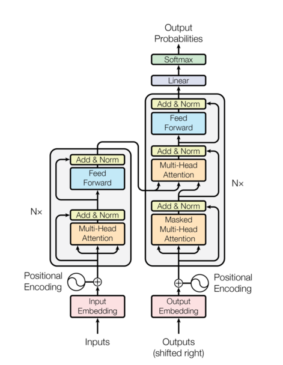

[](https://github.com/jordanchongja)

<style>
  #quarto-margin-sidebar {
    padding-top: 50px; 
  }
</style>

## Paper Overview: Attention is All you Need. 

Felt the need to understand this seminal attention paper to get an idea into transformers before delving deeper into ML use in finance as a whole and understand more about the ML infrastructure and how gradient descent is able to change the world. Full discloure, most of the article is an AI dump, as are most things on the internet these days, but I still feel the compliation of the information helps one learn i guess. Or at least helps me learn. 

### Content Page:
So below is the format that I felt would be most helpful if you're learning about ML for the first time like me, not much background into ML and want to learn more but even the annotated paper is too much. So i start with a clarification of the terms and all the background that the paper references and an intuitive understanding of what it all means. Then i delve into the paper itself. Then lastly I end off with a glossary of the terms, basically section 1 but if they don't warrant a whole explanation of their own. 

* **Section 1:** Primer to the ML terms required for understanding this paper
* **Section 2:** Analysis of the Paper itself
* **Section 3:** Glossary and key terms

Also, below are some useful links that really helped me understand the paper, on top of Gemini of course, and I would implore you to take a look and see if that helps you more than my article.

- [Annotated version of the Attention Paper from the team at NLP Harvard](https://nlp.seas.harvard.edu/annotated-transformer/)
- [IBM Overview on ML/Transformers and all that](https://www.ibm.com/think/topics/transformer-model#1280257394)
- [Visualisation of the Transformer Architecture](https://poloclub.github.io/transformer-explainer/)

---

## Section 1. Primer to the ML terms required for understanding this paper


Before the Primer, lets start with a background to the paper and all. So above is the image for the overall Model Architecture, and on the left half of the image, there is the encoder, and on  the  right half of the image, there is the decoder. Together they make up the transformer model.

The advantage of the transformer model over previous models like RNN is the concept of self-attention. So then with this, the model is able to achieve parallelisation, which greatly speeds up learning, and allows the model to learn dependencies between words. We will look more into these concepts later. 

The topics in the primer are grouped into difference bucket that I feel will aid learning so i hope this structure helps. 

### Section 1.1. High Level Philosophy and Paradigms
Before we delve into the quirks of the model architecture, lets get a high level intuition of how the model operates first. 

#### Transformers vs. RNNs: Why replacing sequential processing (RNNs) with parallel masking gave Transformers such a massive advantage
**Definition:** Before this 2017 paper, the undisputed kings of language translation were **Recurrent Neural Networks (RNNs)** and their advanced cousins, LSTMs. The Transformer paper made a bold claim: you don't need recurrence at all. You can throw away the old architecture entirely, rely _only_ on the Attention mechanism, and achieve massively better results.

**The Old Way: The RNN Sequential Bottleneck** RNNs process text the same way humans read: sequentially, from left to right. If an RNN wants to translate a 20-word sentence, it has to read word 1, then use that memory to read word 2, then use _that_ memory to read word 3... all the way to word 20.

This sequential nature created two massive problems:

1. **The Forgetting Curve:** By the time the RNN got to word 20, the mathematical signal from word 1 had often been diluted or lost (the vanishing gradient problem). It struggled to remember context over long paragraphs.
    
2. **The Speed Limit:** You cannot calculate word 20 until you finish calculating word 19. Because of this, RNNs could not be heavily parallelized across modern GPUs. They were fundamentally slow to train.
    

**The New Way: Parallel Masking in Transformers** The Transformer completely abandoned the left-to-right reading strategy. Instead, it ingests the _entire sentence at the exact same time_.

This is where the **Masked Multi-Head Attention** comes into play. As we discussed in the "Teacher Forcing" section, the model looks at the whole French answer key at once during training. To prevent the model from "cheating" and looking at word 4 while trying to predict word 4, the attention mechanism applies a mathematical mask. It essentially blinds the model to future words in the matrix, allowing it to calculate the predictions for word 1, word 5, and word 20 all simultaneously.

**The Massive Advantage:** Because the Transformer processes everything in parallel, researchers could suddenly unleash the full power of massive GPU clusters (like those NVIDIA P100s). Training times plummeted. Datasets that would have taken RNNs years to read could be processed by Transformers in days. Furthermore, because Attention looks at all words directly, the distance between word 1 and word 100 doesn't matter anymore—the model remembers them equally well.

#### Auto-Regressive Generation
An auto-regressive model generates text one token at a time, where each new token is predicted based on the entire history of tokens generated so far. "Auto" here means self, and means "self-regressive", meaning it uses its own past predictions to predict the next value it needs to predict. 

##### How it works (The Illustration):
Think of the "Next Word Prediction" feature on your phone's keyboard. If you type "How", it might suggest "are". If you pick "are", it looks at "How are" and suggests "you".

The model runs in a rigid, repetitive loop. At every step, the entire history grows by one word, and that new, longer history becomes the new input for the next cycle.

Step-by-Step Visualization of Auto-Regressive Decoding:
Let's say we are translating from English ("What is your name?") to French, and we want to generate the French sequence: "Comment vous appelez-vous ?"

**Step 1: Just Starting**
* **The Model Sees (Input):** `[` `<START>` `]`
* **The Model Thinks:** "Based on the fact I'm just starting... the most likely first word is 'Comment'."
* **The Model Outputs:** `Comment`

**Step 2: Growing History**
* **The Model Sees (New Input):** `[` `<START>`, `Comment` `]`
* **The Model Thinks:** "Based on the English context and the fact I've said 'Comment'... the most likely next word is 'vous'."
* **The Model Outputs:** `vous`

**Step 3: Appending to the History**
* **The Model Sees (New Input):** `[` `<START>`, `Comment`, `vous` `]`
* **The Model Thinks:** "Okay, history is getting longer. 'appelez' comes next."
* **The Model Outputs:** `appelez`

This loop repeats until the model generates a special <END> token, signaling it is finished. The crucial takeaway is that the model's own past decisions are necessary to make future decisions.

This is how the model works during inference, but if you notice, it is quite slow for training since backpropogation and computation of the loss function can only be done once each word has been predicted. So an alternative method of "Teacher Forcing" is done instead during learning, which is covered in more detail below. 

***

#### Training vs. Inference: The Two Faces of the Transformer.
**Definition:** This is the #1 point of confusion in the entire Transformer paper. It is essential to recognize that the Transformer model has two distinct operational modes: **Training** (how it learns) and **Inference** (how it is used in production).

**The Semantic Confusion (Hooking the Paper Diagram):**

When you look at the famous diagram in "Attention is All You Need" (Figure 1), you are looking almost exclusively at how the model behaves during its **Training Phase**.

The biggest clue that this diagram is for **training** is at the bottom of the Decoder:

> **"Outputs (shifted right)"**

This input is NOT the sequence the model is currently generating auto-regressively. This input is the **entire, correct target sentence** (like the perfect French translation) given to the model as an "Answer Key" during training.

##### Why do they look different? The Big Parallelism Advantage

If we trained the model auto-regressively, one word at a time, training would be unbearably slow. A mistake made on the 1st word of a 100-word sentence would propagate all the way down, ruining the training signals for the rest of the sequence.

**Training (Parallel Processing):**
During training, we have the answer key (the perfect translation). The model takes the full English sentence in the Encoder and the full French sentence in the Decoder *all at once*.
* For word #3 in the French sentence, it doesn't use the model's guess for word #2. It looks at the *actual, correct human-written word #2*.
* This allows the Transformer to make guesses for *every word in the sequence simultaneously*. This massive parallel computation is what allowed the Transformer architecture to be trained on datasets millions of times larger than previous architectures (like RNNs), which *had* to train sequentially.

**Inference (Sequential Processing):**
During inference (real-world use), the model does not have the answer key. It must operate auto-regressively, building the sequence word-by-word. It must wait for its output from step $t-1$ to become its input for step $t$.

**Visualizing the Divergence:**
Imagine a track meet.
* **Inference** is a track athlete running a real race. They must run sequentially: from the starting line, past the 100m mark, then the 200m mark, until they finish. Every step they take determines where they are next.
* **Training** is an analyst watching high-speed footage of that same athlete. The analyst has access to the "truth" (the entire race). They don't need to wait for the athlete to run past the 100m mark to evaluate how they did at 200m. They can look at both points in parallel.

How do we unlock this massive parallelism and allow the model to cheat and look at the whole French sentence at once without it simply copying the answer? This is achieved through a specific training technique that acts as the final "Answer Key," known as **Teacher Forcing** (coupled with the **Masked Attention** we see in the diagram), which we will unpack in the next section.


***

#### Teacher Forcing & Exposure Bias: Why the model is penalized for creative but valid answers during training, and how massive datasets solve this.
**Definition:** "Teacher Forcing" is the exact training technique that allows the Transformer to process a whole sentence in parallel. Instead of letting the model use its own (often terrible, untrained) guesses to predict the next word, we force it to use the **ground truth** from the training data.

**How it works (The Illustration):**
Imagine a student taking a math test.

- **Without Teacher Forcing:** The student gets Question 1 wrong. Because Question 2 relies on the answer to Question 1, they get Question 2 wrong as well, and fail the whole test. The feedback at the end isn't very helpful for learning Question 2.
    
- **With Teacher Forcing:** The teacher stands over the student's shoulder. After the student guesses Question 1, the teacher says, "You guessed 5. That's wrong. The real answer is 10. Now, use 10 to solve Question 2."
    

In the Transformer, we feed the entire perfect French sentence into the bottom of the Decoder. When predicting word #4, the model is "forced" to look at the perfect, true words #1, #2, and #3, completely ignoring whatever garbage it might have guessed for word #3 a millisecond earlier.

**The Catch: Exposure Bias**
Teacher Forcing makes training incredibly fast and stable, but it introduces a major flaw known as **Exposure Bias**.

Because the model is strictly penalized if it deviates from the exact "Answer Key" provided in that specific training pair, it is actively punished for being creative. If the training data translates "What is your name?" specifically to "My name is Gemi", and the model correctly guesses the perfectly valid variation "Hello! My name is Gemi", the loss function spikes. It essentially yells, "Wrong! The first word was supposed to be 'My'!"

Furthermore, during real-world inference, the teacher is gone. The model _must_ rely on its own past predictions. If it makes a slight grammatical slip, it suddenly finds itself in a scenario it has never seen before (because it only ever saw perfect, human-written histories during training), which can cause the rest of its output to derail completely.

**The Solution:**
How do we fix this? By throwing an unimaginable amount of data at it. While _one_ training example might strictly force "My name is...", another million examples in the dataset will pair similar inputs with "Hello! My name is...". Over time, the model maps out the statistical probabilities of _both_ valid paths.


#### Translation Bias: How the model doesn't just average out language nuance, but rather learns statistical probability based on its specific training corpus
Definition: A common misconception is that a Transformer inherently understands the "nuance" of language, or that it naturally "averages out" different translation styles into one objective truth. In reality, a Transformer is simply a highly advanced statistical engine. Its output is entirely a reflection of the distribution of its training data.

How it works (The Illustration):
Think of the model as a chameleon. It doesn't know what "good" translation is; it only knows what is frequent.

If you train a model on a massive dataset where 90% of the text consists of dry, literal, word-for-word legal documents (like United Nations transcripts), its mathematical weights will naturally bias toward those literal translations. If it encounters a phrase that has both a literal translation and a beautiful, poetic translation, it will default to the literal one simply because those neural pathways were reinforced 90% of the time.

It does not average the nuance; it outputs the highest probability sequence.

Why this matters today:
This bias is the exact reason why foundational models (like the raw, base versions of GPT or Gemini) are not very useful out of the box. They are prone to weird quirks, robotic tones, or mimicking internet toxicity. To make them helpful and conversational, they require extensive post-training and fine-tuning (like Reinforcement Learning from Human Feedback, or RLHF) to artificially boost the probabilities of the "nuance" and "tone" we actually want to see.


### Section 1.2. Dealing with the Inputs, Hashing and Encoding
Computers do not think in letters; they only understand numbers organized into specific structures like vectors and matrices. In this section, we unpack the pipeline that turns a sentence like "I love AI" into a complex, smart mathematical space that the Transformer can process.

#### Tokenization (The Slicing & Dicing)
**Definition:** Tokenization is the very first step. Before text enters any neural network, the model must chop the text into discrete, manageable units called **tokens**.

**Why it matters:** It is mathematically inefficient to assign a unique ID to every single word in existence (handling suffixes, prefixes, and rare words would make the model's vocabulary explode). To maximize storage efficiency, modern models use algorithms (like Byte-Pair Encoding) to slice text into smaller sub-word chunks.

For example, the rare word `unbelievable` might be tokenized into `un`, `believ`, and `able`. The model creates its entire vocabulary by reusing these common building blocks across thousands of words.

#### The Embedding Matrix (The Advanced Hash Table)

**Definition:** Once we have tokens, we need to turn them into vectors (grids of numbers). The **Embedding Matrix** is fundamentally a massive **Lookup Table**, performing the same logical operation as a traditional computer science **Hash Table**.

It maps a discrete Token ID to a dense vector (e.g., a 512-dimensional row).

##### A "Live" Example: Lookups and Convergence
Think of the Embedding Matrix as a database.
- **The Key:** The unique ID assigned to a token by the tokenizer.
- **The Value:** A row in the matrix containing 512 numbers.

Before training begins, all the numbers in the "Value" rows are **completely random**. The model is an empty slate, unable to distinguish between "cat," "dog," or "airplane."

**The Magic of Learning:** As we discussed in the "Add" (Residual Connection) section, backpropagation iteratively tweaks these 512 numbers after every mistake. Over millions of repetitions, tokens that are contextually related (like synonyms or antonyms) are statistically pushed closer together in that 512-dimensional space, naturally forming semantic relationships without any programmed human rules.

Here is how the logical flow looks in python:
```{python}
#| label: Hashtables
#| warning: false
#| message: false
import numpy as np

# 1. The Tokenizer (A Python Dictionary acting as our Hash Table)
# It strictly maps strings to integer IDs.
vocab_to_id = {
    "The": 0,
    "cat": 1,
    "sat": 2,
    "on": 3,
    "mat": 4
}

# 2. The Embedding Matrix (The "Lookup Table")
# Let's say our vocabulary is 5 words, and our vector dimension is 4 (instead of 512).
# Initially, these are completely random numbers.
num_words = 5
vector_dim = 4

# Setting a seed so the random numbers stay the same if you run this
np.random.seed(42) 
embedding_matrix = np.random.rand(num_words, vector_dim)

def get_word_vector(word):
    # Step A: Look up the integer ID using the dictionary (Hash Table)
    word_id = vocab_to_id.get(word)
    
    if word_id is None:
        return "Word not in vocabulary!"
        
    # Step B: Use that ID as the row index to pull the vector from the matrix
    word_vector = embedding_matrix[word_id]
    
    return word_id, word_vector

# Let's test it with the word "cat"
token_id, vector = get_word_vector("cat")

print(f"Word: 'cat'")
print(f"Token ID: {token_id}")
print(f"Embedding Vector: {vector}")

```


3. Positional Encoding (The Geometry of Order)

**Definition:** Transformers suffer from a critical flaw: they process every word in a sequence simultaneously, meaning they have inherently zero concept of sentence structure or word order. The model sees the sequences "The cat ate the mouse" and "The mouse ate the cat" as mathematically identical sets of words.

RNNs solved this sequentially, but Transformers abandoned sequential processing for speed. To re-inject the order of words without breaking parallelism, the model sums a **Positional Encoding** (PE) onto every single input embedding.

The authors of the paper used fixed mathematical functions (overlapping sine and cosine waves) at different frequencies across different dimensions to generate a unique spatial "signature" for every single word position.

### Visualizing the Geometry: The Positional Spiral
Because we are pairing sine and cosine functions across dimensions, the Positional Encoding matrix essentially builds a 3D geometric spiral that stretches alongside the text. Words close together (e.g., positions 4 and 5) occupy points close together on that spiral path, while words far apart (positions 4 and 20) are located at completely different geometric locations.

When added to the raw word embedding, this PE provides a geometric "nudge" that the Multi-Head Attention later uses to "feel" how far apart words are.

```{python}
#| label: PositionalEncoding
#| warning: false
#| message: false


import numpy as np
import plotly.graph_objects as go

def get_positional_encoding(num_tokens, d_model):
    """
    Standard Positional Encoding from "Attention is All You Need"
    """
    pe = np.zeros((num_tokens, d_model))
    for pos in range(num_tokens):
        for i in range(0, d_model, 2):
            # sin for even dimensions, cos for odd dimensions
            div_term = np.exp(i * -np.log(10000.0) / d_model)
            pe[pos, i] = np.sin(pos * div_term)
            pe[pos, i + 1] = np.cos(pos * div_term)
    return pe

# Parameters
MAX_LEN = 100  # Number of words/positions
D_MODEL = 12   # Small dimension for clear visualization

# 1. Generate the raw PE matrix
pe_matrix = get_positional_encoding(MAX_LEN, D_MODEL)

# 2. Select specific dimensions to pair and visualize
# We pair Dim 2i (sin) with Dim 2i+1 (cos) to create spirals
head_idx = 0 # Visualize head #1
sin_dim = head_idx * 2
cos_dim = (head_idx * 2) + 1

# 3. Build the Plotly 3D visualization
fig = go.Figure(data=[go.Scatter3d(
    x=np.arange(MAX_LEN),  # Position along sentence
    y=pe_matrix[:, sin_dim], # Dimension 2i (sine)
    z=pe_matrix[:, cos_dim], # Dimension 2i+1 (cosine)
    mode='lines+markers',
    marker=dict(
        size=4,
        color=np.arange(MAX_LEN), # Color indicates position 0 to 100
        colorscale='Viridis', 
        opacity=0.8
    ),
    line=dict(
        color='lightgray',
        width=2
    )
)])

# Add layout details
fig.update_layout(
    title=f'Positional Encoding Spiral: Dim {sin_dim} (Sin) vs Dim {cos_dim} (Cos) over Position 0-{MAX_LEN}',
    scene=dict(
        xaxis_title='Word Position index (0-100)',
        yaxis_title='Vector Dimension Value (Sine)',
        zaxis_title='Vector Dimension Value (Cosine)',
        aspectmode='manual',
        aspectratio=dict(x=1, y=0.5, z=0.5), # Shrink Y and Z to show the stretching
    ),
    width=1000,
    height=800,
)

# Render
fig.show()
```

This code generates an interactive 3D plot. You can see how positions 0, 1, and 2 are tightly clustered, but stretch far away on the spiral compared to position 99, 100, illustrating how geometric proximity now encodes temporal proximity in the sentence.


### Section 1.3. The "Database" Concept (Q, K, V)
Once the text is converted into geometric vectors (complete with positional encoding), the Transformer needs to figure out how these words relate to each other. It does this using the Multi-Head Attention mechanism, which relies on three distinct vectors for every single word: the Query (Q), the Key (K), and the Value (V).


#### 1. The Search Engine Analogy
**Definition:** The authors of the paper named these vectors Q, K, and V because the mathematical operation mimics the logic of Information Retrieval—exactly like searching for a video on YouTube or a record in a relational database.

Think of how a search engine works:
- **The Query (Q):** This is what you actively type into the search bar. It represents what the word is _looking for_. (e.g., The word "bank" might project a Query asking, "Where are the adjectives that describe me?")
    
- **The Key (K):** This is the metadata or the tags attached to the files in the database. It represents what the word _is_. (e.g., The word "river" might project a Key stating, "I am a water-related noun.")
    
- **The Value (V):** This is the actual content of the file itself. It is the deep, underlying semantic meaning of the word that will be passed forward if there is a match.
    
The Attention mechanism takes a word's **Query**, compares it against every other word's **Key** to calculate a match score, and then uses that score to extract the relevant **Values**.

#### 2. Matrix Projections: Where do Q, K, and V come from?
**Definition:** A common misconception is that the model uses the raw word vector ($x$) to do all of this. It does not. The original vector $x$ contains too much jumbled information to be a good Query, Key, and Value all at once.

Instead, the model creates three distinct "shadows" or projections of the original word.

**The Mechanics:**
Inside the Attention layer, the model contains three separate weight matrices: $W^Q$, $W^K$, and $W^V$. The model mathematically multiplies the original word vector ($x$) by these matrices to generate the specific Q, K, and V vectors.

- $Q = x W^Q$
- $K = x W^K$
- $V = x W^V$

You can think of these $W$ matrices as specific camera lenses.
- The $W^Q$ lens filters out everything except what the word is looking for.
- The $W^K$ lens filters out everything except the word's descriptive tags.
- The $W^V$ lens filters the pure meaning.

#### 3. Natural Emergence (No Human Hardcoding)

**Definition:** It is crucial to understand that researchers **do not program** grammar rules, noun identifiers, or vocabulary structures into these $W$ matrices.

Before training begins, $W^Q$, $W^K$, and $W^V$ are completely random grids of numbers. The model has absolutely zero concept of what a "subject" or a "verb" is.

These matrices organize themselves entirely through the trial-and-error of gradient descent. When the model makes a bad translation, backpropagation slightly tweaks the numbers inside $W^Q$ and $W^K$. 

Over billions of iterations, these matrices naturally converge into a state where they reliably project the geometric data in a way that perfectly aligns subjects with verbs, or pronouns with nouns. The model builds its own internal, highly complex search engine entirely from scratch.

### Section 1.4. The Core Math & Mechanics
We know the model generates Queries (what it's looking for), Keys (what it is), and Values (its meaning). But how does it actually compare them? The answer lies in the famous **Scaled Dot-Product Attention** equation:

$$\text{Attention}(Q, K, V) = \text{softmax}\left(\frac{QK^T}{\sqrt{d_k}}\right)V$$

This equation might look intimidating, but it is just a series of logical filtering steps. Let's break down the physical blocks.

#### 1. MatMul ($QK^T$): Calculating the Match Score
**Definition:** "MatMul" stands for Matrix Multiplication. To find out which words relate to each other, the model multiplies the Query matrix ($Q$) by the transposed Key matrix ($K^T$).

**How it works:**
In linear algebra, multiplying two vectors together like this calculates their **dot product**. The dot product is essentially a mathematical measurement of similarity.

- If the Query vector for "bank" and the Key vector for "river" point in the exact same direction in high-dimensional space, their dot product will be a massive positive number (a strong match).
    
- If "bank" and the Key for "finance" point in different directions, the score will be low.
    
    By running MatMul on the entire sequence at once, the model generates a massive grid of scores, showing exactly how strongly every single word in the sentence aligns with every other word.
    

#### 2. The Scaling Factor ($\sqrt{d_k}$) & Softmax: Saving the Gradients
**Definition:** We have raw match scores, but we need to turn them into usable percentages (probabilities). We do this using a **Softmax** function, which squashes all the numbers so they fall between 0.0 and 1.0, and forces them to add up to exactly 1.0.

**The Mathematical Danger:**
As models get larger, the dimensions of the Keys ($d_k$) get larger. When you calculate the dot product ($QK^T$) of massive vectors, the resulting numbers can explode into the thousands.

If you feed massive numbers into a Softmax function, it behaves aggressively. It will give the top score a probability of `0.9999` and everything else `0.0001`.

- When this happens, the mathematical slope (the gradient) becomes completely flat.
    
- If the gradient is flat, **backpropagation stops working**, and the model cannot learn. This is the dreaded Vanishing Gradient problem.
    

**The Fix:**
Before running Softmax, the researchers simply divided the raw $QK^T$ scores by the square root of the dimension size ($\sqrt{d_k}$). This acts as a mathematical anchor, keeping the numbers small and ensuring the gradients remain healthy and steep during training. Finally, these perfectly scaled percentages are multiplied by the **Values ($V$)** to extract the actual meaning of the matched words.

#### 3. Multi-Head Attention vs. Layers
**Definition:** It is incredibly common to mix up "Heads" and "Layers" because they both imply multiplicity. However, they operate on completely different axes.

- **Multi-Head Attention (The Horizontal Split):** This happens _inside_ a single processing block. Instead of doing one massive attention calculation, the model splits its 512 dimensions into 8 smaller "heads" (64 dimensions each) and runs them in parallel. This allows the model to look at different aspects of the same word simultaneously. Head 1 might calculate the grammatical structure, while Head 2 calculates the emotional tone.
    
- **Layers (The Vertical Stack):** The original Transformer stacks 6 of these entire blocks on top of each other. The final output of Layer 1 becomes the input for Layer 2. As the text moves vertically up the stack, the model builds deeper, more abstract, and more complex representations of the sentence.
    

#### 4. Masking: Blinding the Model
**Definition:** As we discussed in the Teacher Forcing section, during training, the model receives the entire translated French sentence all at once so it can process it in parallel. But if it has the whole sentence, what stops it from simply "looking ahead" at word 4 when it is supposed to be predicting word 4?

**How it works:**
Inside the Decoder, the model uses a **Masked Multi-Head Attention** layer.

Right before the Softmax function is applied to the $QK^T$ scores, the model applies a mask over the matrix. It replaces all the scores of "future" words with negative infinity ($-\infty$).

When you run negative infinity through a Softmax function, the math dictates that the resulting probability is exactly `0`.

Therefore, when the model is calculating the attention for word 3, the probabilities for words 4, 5, and 6 are forced to absolute zero. The model is mathematically blinded, unable to draw any data or context from the future, forcing it to actually learn how to predict instead of just copying the answer.


### Section 1.5. Stabilizing and Processing the Network
Once the Multi-Head Attention mechanism figures out how all the words in a sentence relate to each other, the resulting mathematical matrices are messy. If we just pass these raw numbers deeper and deeper into a 6-layer or 12-layer model, the math will eventually break down. This section covers the architectural tricks used to process the context and keep the network stable.


#### 1. Dropout (The "Disappearing" Neurons)
**Definition:** Deep neural networks are so powerful that they often suffer from **overfitting**—meaning they just memorize the training data perfectly instead of actually learning the underlying rules of language. To prevent this, researchers use a regularization technique called **Dropout**.

**How it works:**
During the training phase, Dropout acts like a controlled sabotage. At every step, the network randomly turns off (or "drops") a certain percentage of its neurons (e.g., 10%).

**Why this helps:**
Imagine a team of workers where one person does all the heavy lifting. If that person gets sick, the whole team fails. Dropout prevents the network from relying too heavily on any single neuron or specific pathway to make a prediction. Because neurons keep randomly vanishing, the network is forced to distribute its learned information across the entire model, creating a highly redundant, robust, and generalized understanding of the data.

_(Note: Dropout is strictly a training tool. During real-world inference, it is turned off, and all neurons work together.)_

#### 2. Residual Connections (The "Add")
**Definition:** In deep networks, the mathematical signals (gradients) used to update the weights during training get smaller and smaller as they travel backward through the layers. If they get too small, the network stops learning entirely—a catastrophic issue known as the **Vanishing Gradient Problem**.

To fix this, the Transformer uses **Residual Connections** (also called Skip Connections) wrapped around every major sub-layer.

**How it works:**
Instead of just taking the input vector $x$, running it through the Attention layer, and passing the new output forward, the network does something simple but brilliant: it takes the original input $x$ and mathematically adds it to the layer's output.

The equation is: $x + \text{Sublayer}(x)$

This creates an "information highway." It provides a clean, unobstructed shortcut for both the gradients to flow backward during training and the original word meanings (plus their positional encodings) to flow forward, ensuring the deepest layers of the model never "forget" what the original sentence was.

#### 3. Layer Normalization (The "Norm")
**Definition:** When you add vectors together (like in the step above), the numbers can start to grow uncontrollably large or shrink to zero. **Layer Normalization** is a technique used immediately after the addition step to rein those numbers back in.

**How it works:**

The model takes the newly added matrix, calculates the mean and standard deviation of its features, and rescales the numbers so they are centered around zero. It essentially "smooths out" the data. By keeping the numbers mathematically consistent and stable at every single layer, the model can train significantly faster and more reliably.

Together, these two steps form the famous **Add & Norm** block you see repeated throughout the entire Transformer architecture diagram.

#### 4. Position-wise Feed-Forward Networks (The Processing Filter)
**Definition:** The Multi-Head Attention layer is brilliant at figuring out _context_ (e.g., it calculates that the word "bank" is closely related to the word "river" in this specific sentence). However, Attention is purely a communication step between words. It doesn't actually _process_ that new, context-heavy information.

That is the job of the **Position-wise Feed-Forward Network (FFN)**.


**How it works:**
After the Attention and Add & Norm steps, every single word is passed through its own classic, fully connected neural network. It is called "position-wise" because the exact same network is applied to each word individually and independently.

It consists of two linear transformations with a non-linear activation function (ReLU) sandwiched in between:
1. **Expansion:** It takes the 512-dimensional vector and dramatically expands it (often to 2048 dimensions), allowing the network to unpack and analyze the complex patterns Attention just found.
    
2. **Activation:** The ReLU function adds non-linear logic, effectively "firing" certain neurons based on what it finds.
    
3. **Contraction:** It compresses the data back down to 512 dimensions so it can be passed smoothly to the next layer.
    
If Attention is the "meeting" where words share context, the Feed-Forward Network is the "desk work" where each word individually processes what it just learned.


### Section 1.6. Copnclusions and the Final Output
We have looked at the micro-mechanics (Attention, Positional Encoding, Matrices). Now, let's zoom out and look at the macro-architecture. The original Transformer is split into two distinct towers: the **Encoder** (the left side of the paper's diagram) and the **Decoder** (the right side).

## 1. The Encoder vs. The Decoder
**Definition:** If we are translating English to French, the Encoder's job is to completely understand the English sentence. The Decoder's job is to use that understanding to write the French sentence.

### The Encoder (Building the Context)

1. The English text flows into the bottom of the Encoder.
    
2. It passes through the Multi-Head Attention, where the English words figure out how they relate to _each other_ (e.g., "bank" relates to "river").
    
3. It passes through the Feed-Forward Network to process that context.
    
4. It repeats this through $N$ layers (usually 6).
    
5. **The Final Output:** The Encoder finishes its job and outputs a final set of **Keys (K)** and **Values (V)**. It essentially holds a massive, highly complex mathematical "database" representing the pure meaning of the English sentence.
    

### The Decoder (Writing the Translation)
1. The model starts generating the French translation auto-regressively (one token at a time).
    
2. The French words generated _so far_ flow into the bottom of the Decoder.
    
3. They pass through the **Masked Multi-Head Attention** (as discussed, the mask prevents it from cheating during training). Here, the French words figure out how they relate to _other French words_.
    
4. **The Meeting Point (Cross-Attention):** This is the magic step. The Decoder has a second Attention block. Here, the French text generates the **Queries (Q)**, but it checks them against the **Keys (K) and Values (V)** that came directly from the _Encoder_.
    
    - The Decoder is essentially asking the English database: _"Based on the French words I've written so far, what English concept should I translate next?"_
        
5. This repeats through $N$ layers until the Decoder outputs the final predicted word.
    

## 2. Beyond the Greedy Decoder (Making Choices)
**Definition:** At the very top of the Decoder, the model outputs a probability distribution for the next word (e.g., "Je" = 40%, "Nous" = 30%, "Le" = 5%). How does it actually pick the word that appears on your screen?

The most basic method is a **Greedy Decoder**. A greedy decoder simply looks at the probabilities and always picks the #1 highest score.

**Why Greedy is Flawed:**
Greedy decoding has blinders on. It only cares about the immediate next step. If it makes a slightly sub-optimal choice on word 2, it is locked into that path and cannot backtrack. This often leads to text that is repetitive, gets stuck in logical loops, or sounds robotic.

To fix this, modern AI uses alternative generation strategies to introduce foresight or controlled creativity:

- **Beam Search (The Chess Player):** Instead of just picking the #1 word, Beam Search explores multiple paths simultaneously. If the "beam width" is 3, it holds the top 3 most likely words in its memory. It then looks at the _next_ step for all 3 of those branches to see which path yields the highest _overall_ probability for the whole sentence. It prevents the model from painting itself into a corner.
    
- **Top-K Sampling (The Dice Roll):** The model looks at the top $K$ most likely words (e.g., the top 40 words) and essentially rolls a weighted die to pick one. The #1 word is still the most likely to be chosen, but sometimes it will pick the #5 word or the #12 word. This prevents repetitive loops and makes the text sound more naturally human.
    
- **Top-p / Nucleus Sampling (The Dynamic Dice):** Instead of a fixed number of words ($K$), the model dynamically shrinks or expands its pool of choices based on a threshold ($p$). If $p = 0.90$, the model pools together just enough top words whose probabilities add up to 90%. If the model is very confident, the pool might only be 2 words. If it's unsure, the pool might be 50 words. This allows for creativity while preventing complete gibberish.
    
- **Temperature (The Confidence Slider):** Temperature is a mathematical tweak applied right before the final selection. A low temperature (e.g., 0.1) sharpens the math, making the most likely words even _more_ likely (safe, factual, but robotic). A high temperature (e.g., 0.9) flattens the math, making the less likely words more competitive (creative, chaotic, and sometimes hallucinatory).


## Section 2.  Analysis of the Paper itself
With the foundational concepts locked in, we can finally look at Figure 1 from the "Attention Is All You Need" paper and trace exactly how a piece of text flows through the entire system.

The paper describes the Transformer as an **Encoder-Decoder structure**. Let’s track the journey of translating the English sentence _"The cat sat"_ into the French sentence _"Le chat s'est assis"_.

## Step 1: Entering the Matrix (The Input Stage)
Before the model does any "thinking," the English source text must be converted into a mathematical format.

1. **Input Embedding:** The English tokens (`The`, `cat`, `sat`) are looked up in the embedding matrix. Each token is converted into a 512-dimensional vector ($d_{model} = 512$).
    
2. **Positional Encoding:** Because the model will process all these words simultaneously, it has no idea what order they are in. We add the geometric sine/cosine waves to each vector so the model physically "feels" that `The` is at position 0, and `cat` is at position 1.
    
These spatially aware vectors are now bundled together into one large matrix, $X$, and passed into the Encoder.

## Step 2: The Encoder Stack (Building the Context)
The left side of the paper's diagram is the Encoder. The paper states that the Encoder is composed of a stack of $N = 6$ identical layers. The goal of this entire stack is to output a deep, highly contextualized representation of the English sentence.

Inside each of the 6 layers, the data flows through two distinct sub-layers:

### Sub-layer 1: Multi-Head Self-Attention
The matrix $X$ enters the Attention block. Here, the model generates the Queries ($Q$), Keys ($K$), and Values ($V$) by multiplying $X$ against its learned weight matrices.

- It is called **Self-Attention** because the Queries, Keys, and Values all come from the exact same place (the English input). The English words are attending to _themselves_.
    
- The model runs the scaled dot-product equation: $\text{Attention}(Q, K, V) = \text{softmax}\left(\frac{QK^T}{\sqrt{d_k}}\right)V$ across 8 separate "heads" in parallel.
    
- This allows the word `sat` to mathematically connect itself to `cat` (the entity doing the sitting).

**The Wrap-Around:**
To prevent the vanishing gradient problem, the original input $X$ bypasses the attention block via a **Residual Connection** and is added to the output. The result is immediately stabilized using **Layer Normalization**.

### Sub-layer 2: Position-wise Feed-Forward Network
The context is set, but it needs to be processed. The normalized matrix passes into the Feed-Forward Network (FFN).

- Each word's 512-dimensional vector is individually expanded to 2048 dimensions, passed through a ReLU activation to learn complex non-linear patterns, and compressed back to 512.
    
- This is again wrapped in a Residual Connection and Layer Normalization.
    

This exact process repeats 6 times. By the time the data exits Layer 6, the Encoder has built the ultimate "Database" of the English sentence. It outputs the final **Keys (K)** and **Values (V)**, which are held in memory.

## Step 3: The Decoder Stack (Writing the Translation)
Now we move to the right side of the diagram. The Decoder is also a stack of $N = 6$ identical layers, but it has a fundamentally different job: it must generate the French translation token by token, auto-regressively.

To do this, it uses _three_ sub-layers. Let's assume the model has already generated `<START> Le chat` and is trying to predict the next word.

### Sub-layer 1: Masked Multi-Head Self-Attention
The French sequence generated so far (`<START> Le chat`) is embedded, gets its positional encoding, and enters the first block.

- This is another **Self-Attention** mechanism. The French words are looking at other French words to build grammatical structure.
    
- **The Mask:** Because we use Teacher Forcing during training (feeding the whole French sequence at once), a mask of negative infinity ($-\infty$) is applied to future positions. This mathematically forces the Softmax function to zero out any information from words that haven't been "generated" yet.
    

### Sub-layer 2: Multi-Head Cross-Attention (The Meeting Point)
This is the bridge between the two halves of the model.

- The **Queries ($Q$)** come from the output of the Decoder's previous sub-layer (the French context).
    
- The **Keys ($K$) and Values ($V$)** are pulled directly from the final output of the **Encoder** (the English context).
    

Here, the French word `chat` (the Query) searches the English database (the Keys) to figure out what concept it should translate next. It heavily matches with the English word `sat`, pulling that meaning (the Value) into the Decoder stream.

### Sub-layer 3: Position-wise Feed-Forward Network
Just like in the Encoder, this mixed French-English contextual data is passed through the Feed-Forward network to be processed, complete with Residual Connections and Layer Normalization.

This process repeats through all 6 Decoder layers, progressively refining the prediction.

## Step 4: The Final Linear and Softmax Layer
After exiting the 6th layer of the Decoder, we have a highly processed 512-dimensional vector representing the model's "thought" for the next token. But a 512-dimensional vector isn't a French word.

1. **The Linear Layer:** This is a simple neural network layer that projects the 512-dimensional vector into a massive vector that is the exact size of the model's entire vocabulary (e.g., 30,000 words).
    
2. **The Softmax Layer:** This function squashes those 30,000 raw numbers into a probability distribution. Every single word in the French vocabulary gets a percentage.
    

The word with the highest percentage (or the one selected via Beam Search/Top-p sampling) is chosen as the final output. The model outputs `s'est`, appends it to the sequence, and the entire Decoder loop starts all over again.


## Section 3.  Glossary and key terms
This glossary provides quick definitions for the core concepts and mathematical operations that power the Transformer architecture.

### The Foundations
- **Auto-Regressive Generation:** The process of generating text one token at a time, where every new token is predicted based on the sequence generated so far.
    
- **Tokenization:** The algorithmic slicing of text into smaller, mathematically manageable chunks (sub-words or characters) before entering the model.
    
- **Embedding Matrix:** A massive lookup table where each discrete token ID is mapped to a dense, high-dimensional vector of numbers (e.g., a 512-dimensional row).
    
- **Positional Encoding:** The geometric addition of sine and cosine wave functions to a word's vector, allowing the model to mathematically "feel" the sequential order of words despite processing them in parallel.
    

### The "Database" Engine
- **Query (Q):** A vector representing what a specific word is actively _looking for_ within the sentence context.
    
- **Key (K):** A vector representing the "tags" or metadata of a word, indicating what the word _is_.
    
- **Value (V):** A vector containing the actual, deep semantic meaning of the word.
    
- **MatMul ($QK^T$):** Matrix Multiplication. The mathematical dot-product operation used to compare Queries and Keys, calculating exactly how strongly two words match.
    
- **SoftMax:** A mathematical function that squashes raw match scores into a clean probability distribution, forcing all values to fall between 0.0 and 1.0 and sum to exactly 1.0.
    

### The Architecture Blocks
- **Self-Attention:** An Attention mechanism where the Queries, Keys, and Values all come from the exact same source text (e.g., the English sentence looking at itself).
    
- **Cross-Attention:** The bridge between the Encoder and Decoder. The Queries come from the _target_ language (French), while the Keys and Values come from the _source_ language (English).
    
- **Multi-Head Attention:** Splitting the 512 dimensions into smaller chunks (e.g., 8 heads of 64 dimensions) so the model can calculate multiple different types of relationships (grammar, tone, vocabulary) simultaneously.
    
- **Position-wise Feed-Forward Network:** A classic, fully connected neural network applied independently to every single word to process the context gathered by the Attention layer.
    

### Stability & Training
- **Teacher Forcing:** A training technique where the entire "correct" target sentence is fed into the Decoder at once, massively speeding up training by allowing for parallel computation.
    
- **Masking:** A mathematical blinder (using negative infinity) applied during Teacher Forcing to prevent the model from "looking ahead" at future words before predicting them.
    
- **Residual Connection (Add):** A mathematical shortcut ($x + \text{Sublayer}(x)$) that adds the original input of a layer to its output, preventing the network from forgetting the original text and stopping gradients from vanishing.
    
- **Layer Normalization (Norm):** Re-centering the numbers in a matrix after an addition step (mean of 0, standard deviation of 1) to keep the math stable and prevent values from exploding.
    
- **Dropout:** A regularization technique used _only_ during training that randomly turns off a percentage of neurons, forcing the network to learn robust patterns instead of just memorizing data.
    

### Generation Strategies
- **Greedy Decoding:** Always selecting the single word with the highest probability score at each step. Fast, but prone to repetitive and rigid output.
    
- **Beam Search:** Keeping multiple probable sentence paths in memory simultaneously to find the sequence with the highest overall probability.
    
- **Top-K / Top-p Sampling:** Introducing controlled randomness by rolling a weighted die over the top-scoring choices, allowing for more natural and creative text generation.